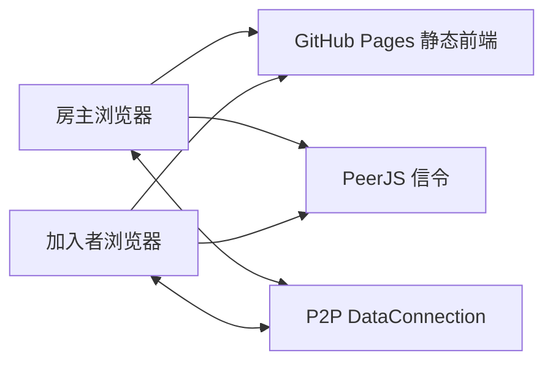
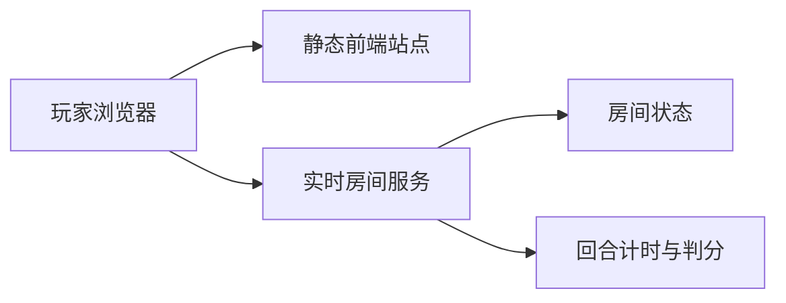

# 多人互动与部署方案

## 在线访问方案

当前版本是 Vite + React 静态前端，可以直接部署成一个可访问链接：

- GitHub Pages：适合比赛提交的静态 Demo 链接。需要配置 GitHub Actions 执行 `npm ci`、`npm run build`，发布 `dist/`。
- Vercel / Netlify：适合快速拿到预览链接，推送 Git 仓库后自动构建，构建命令 `npm run build`，发布目录 `dist`。
- 腾讯云静态网站托管 / CloudBase：如果想更贴近腾讯生态，可以把 `dist/` 上传为静态站点。

当前提交版已经可以通过 GitHub Pages 在线试玩，并使用 PeerJS 公共信令完成轻量 P2P 联机。也就是说，比赛 Demo 可以先不部署自有后端；如果后续要把它做成更稳定的正式多人游戏，再升级到自托管实时服务。

## 当前 MVP 架构

当前版本采用“静态前端 + PeerJS 公共信令 + 浏览器 P2P 数据通道”的轻架构：



当前职责划分：

- 房主创建房间后自动进入等待区，并生成房间码和邀请链接。
- 加入者输入房间码连接房主。
- 房主点击“开始本局”后广播初始房间快照。
- 房主端负责题目、剪纸者轮换、计分、回合结束和结算状态。
- 加入者端接收剪纸路径、猜词、分数和结果页快照。
- 每局结束后可继续下一局，也可返回大厅。

## 后续正式服务推荐

如果要提高比赛现场或公开访问时的稳定性，建议从 PeerJS 公共信令升级为“静态前端 + 实时房间服务”的轻架构：



### 方案 A：Supabase Realtime

适合最快做出更稳定的可演示多人房间：

- 前端仍部署在 GitHub Pages / Vercel。
- Supabase Realtime 负责房间频道、玩家在线状态、路径同步、猜词消息。
- 房间频道命名示例：`room:{roomId}`。
- 同步事件包括：
  - `player_joined`
  - `round_started`
  - `cut_path_added`
  - `guess_sent`
  - `guess_correct`
  - `round_finished`

优点：不用自己维护 WebSocket 服务，开发速度快。  
限制：判分和题目最好仍由一个可信服务控制，否则纯前端容易被改答案。

### 方案 B：Node.js + Socket.IO

适合想更像真正游戏服务器：

- 前端部署在 Vercel / GitHub Pages。
- 后端部署在 Render / Railway / Fly.io / 腾讯云轻量服务器。
- 后端维护房间、题目、回合状态、倒计时、得分。
- 前端只提交路径点和猜词，服务端广播结果。

优点：游戏规则更可控，后续扩展真实匹配、观战、断线重连更稳。  
限制：需要部署并维护一个后端服务。

## 房间状态设计

```ts
type RoomState = {
  roomId: string;
  foldMode: "half" | "quarter";
  foldOrientation: "vertical" | "horizontal";
  phase: "lobby" | "drawing" | "guessing" | "result";
  drawerId: string;
  answer: string;
  answerLength: number;
  roundEndsAt: number;
  players: Player[];
  paths: CutPath[];
  guesses: Guess[];
};
```

## 同步策略

不要同步视频或画布截图，只同步轻量事件：

- 绘制中：按笔同步路径点，或者每 100ms 合并发送草稿点。
- 松手后：广播一条完整 `cut_path_added`。
- 猜词：广播文本和是否猜中。
- 计分：由服务端按猜中顺序写入并广播。

## 当前比赛原型状态

当前版本已经接入静态站可运行的 PeerJS P2P 联机房间，适合先部署到 GitHub Pages 做在线演示。房主创建房间后会生成房间码和邀请链接，加入者通过房间码进入，剪纸路径、猜词消息、猜中状态、分数和结果页由房主端同步。

已完成的多人闭环：

1. 创建房间 / 输入房间码加入。
2. 玩家自定义昵称，最多 10 个字。
3. 房主等待区开始游戏。
4. 剪纸者轮流切换。
5. 二折支持横折 / 竖折随时切换。
6. 猜题页显示答案字数提示。
7. 猜中顺序影响得分。
8. 每局结束进入结算页，支持下一局或结束返回。

当前 QA 结论：

- 生产构建通过。
- 手机端单人完整流程通过。
- GitHub Pages 在线资源已确认更新。
- 双浏览器 P2P 自动化测试在公共 PeerJS 信令下偶发连接等待超时；失败点集中在连接准备或加入等待阶段，未复现“开始后白屏”的运行时崩溃。

下一阶段如果要改成更稳定的正式多人服务，优先实现：

1. 自托管 PeerJS Server、Supabase Realtime 或 Socket.IO 房间服务。
2. 服务端维护房间权威状态。
3. 服务端按猜中顺序计分。
4. 断线重连与房间恢复。

短片生成、账号系统、付费道具、复杂匹配都不进入 MVP。

## 参考链接

- GitHub Pages：<https://docs.github.com/en/pages/getting-started-with-github-pages/creating-a-github-pages-site>
- Vite 部署到 GitHub Pages：<https://vite.dev/guide/static-deploy.html#github-pages>
- Supabase Realtime：<https://supabase.com/docs/guides/realtime>
- Render WebSocket 服务：<https://render.com/docs/websocket>
