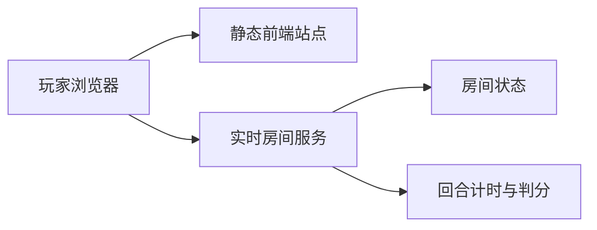

# 多人互动与部署方案

## 在线访问方案

当前版本是 Vite + React 静态前端，可以直接部署成一个可访问链接：

- GitHub Pages：适合比赛提交的静态 Demo 链接。需要配置 GitHub Actions 执行 `npm ci`、`npm run build`，发布 `dist/`。
- Vercel / Netlify：适合快速拿到预览链接，推送 Git 仓库后自动构建，构建命令 `npm run build`，发布目录 `dist`。
- 腾讯云静态网站托管 / CloudBase：如果想更贴近腾讯生态，可以把 `dist/` 上传为静态站点。

如果只展示当前单机 Demo，GitHub Pages 就够用；如果要做真正多人联机，需要额外的实时服务，不能只靠 GitHub Pages。

## 多人联机推荐架构

第一版多人建议采用“静态前端 + 实时房间服务”的轻架构：



### 方案 A：Supabase Realtime

适合最快做出可演示多人房间：

- 前端仍部署在 GitHub Pages / Vercel。
- Supabase Realtime 负责房间频道、玩家在线状态、路径同步、猜词消息。
- 房间频道命名示例：`room:{roomId}`。
- 同步事件包括：
  - `player_joined`
  - `round_started`
  - `cut_path_added`
  - `guess_sent`
  - `guess_correct`
  - `round_finished`

优点：不用自己维护 WebSocket 服务，开发速度快。  
限制：判分和题目最好仍由一个可信服务控制，否则纯前端容易被改答案。

### 方案 B：Node.js + Socket.IO

适合想更像真正游戏服务器：

- 前端部署在 Vercel / GitHub Pages。
- 后端部署在 Render / Railway / Fly.io / 腾讯云轻量服务器。
- 后端维护房间、题目、回合状态、倒计时、得分。
- 前端只提交路径点和猜词，服务端广播结果。

优点：游戏规则更可控，后续扩展真实匹配、观战、断线重连更稳。  
限制：需要部署并维护一个后端服务。

## 房间状态设计

```ts
type RoomState = {
  roomId: string;
  foldMode: "half" | "quarter";
  phase: "lobby" | "drawing" | "guessing" | "result";
  drawerId: string;
  answer: string;
  roundEndsAt: number;
  players: Player[];
  paths: CutPath[];
  guesses: Guess[];
};
```

## 同步策略

不要同步视频或画布截图，只同步轻量事件：

- 绘制中：按笔同步路径点，或者每 100ms 合并发送草稿点。
- 松手后：广播一条完整 `cut_path_added`。
- 猜词：广播文本和是否猜中。
- 计分：由服务端按猜中顺序写入并广播。

## 比赛原型建议

为了控制开发风险，当前提交版先保留 Bot 模拟多人。下一阶段做多人时，优先实现：

1. 创建房间 / 加入房间链接。
2. 玩家在线列表。
3. 剪纸者路径实时广播。
4. 猜词消息广播。
5. 服务端按猜中顺序计分。

短片生成、账号系统、付费道具、复杂匹配都不进入 MVP。

## 参考链接

- GitHub Pages：<https://docs.github.com/en/pages/getting-started-with-github-pages/creating-a-github-pages-site>
- Vite 部署到 GitHub Pages：<https://vite.dev/guide/static-deploy.html#github-pages>
- Supabase Realtime：<https://supabase.com/docs/guides/realtime>
- Render WebSocket 服务：<https://render.com/docs/websocket>
